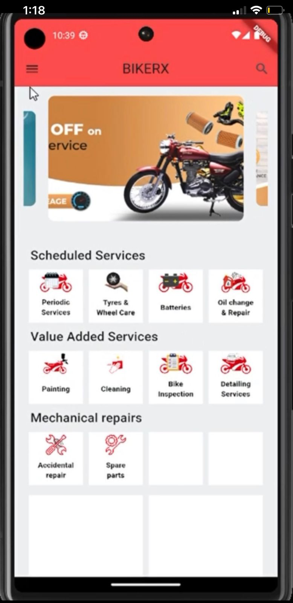
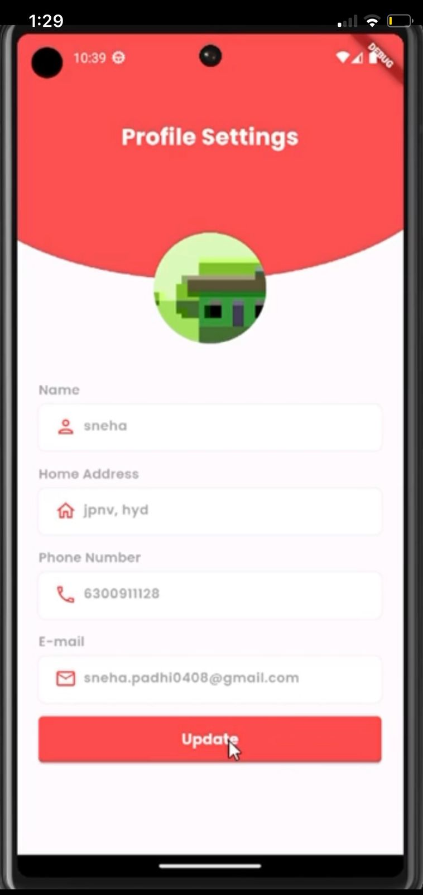
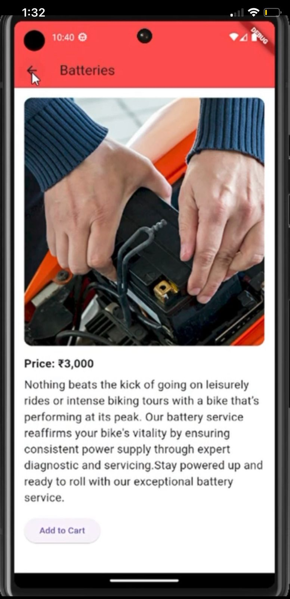
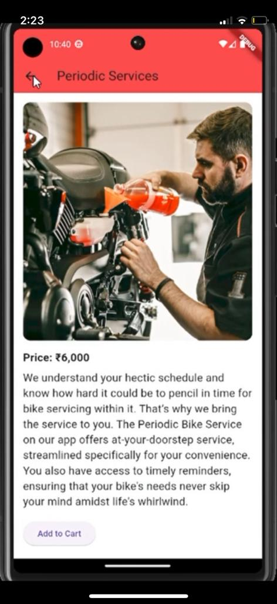
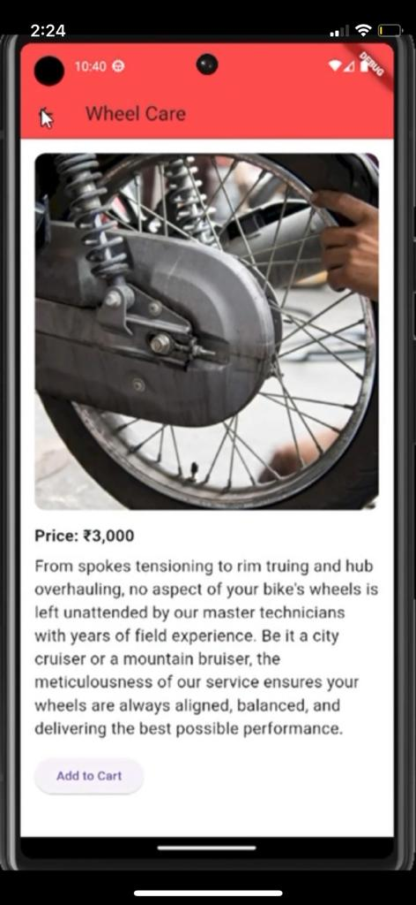
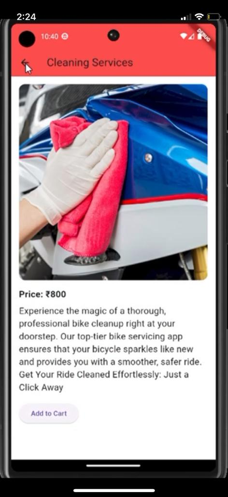
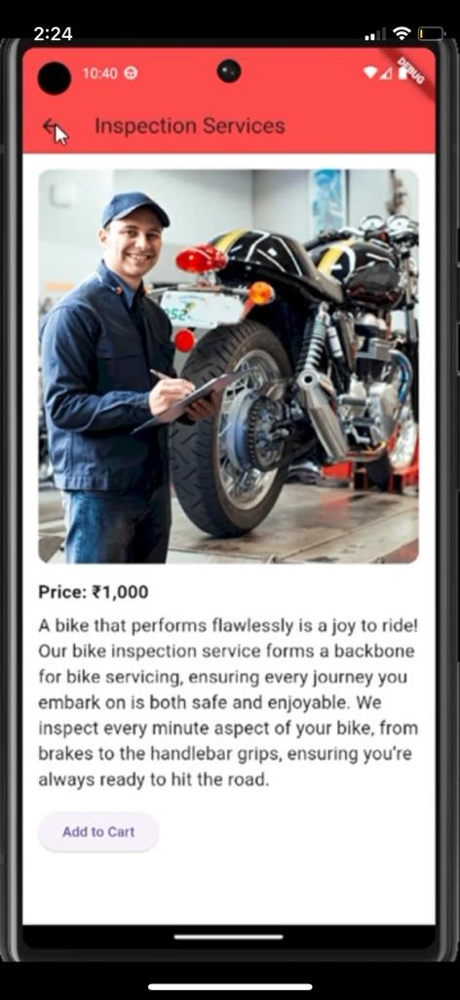
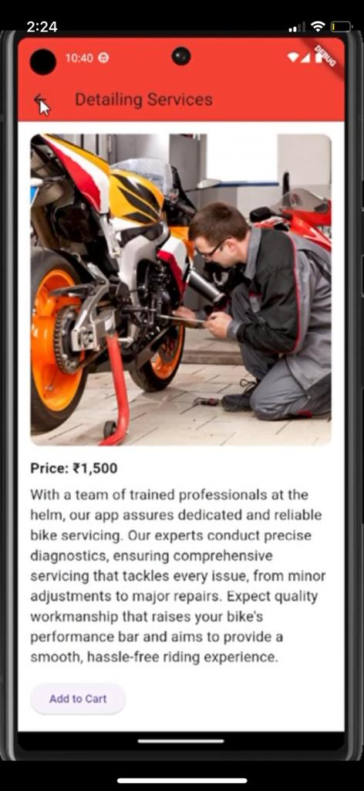

# BIKERX App

## Overview

Welcome to BIKERX, your one-stop solution for all your bike servicing needs. Whether you're looking for routine maintenance, repairs, or value-added services, BIKERX has got you covered. This README.md file provides an overview of the app's features, functionality, and how to get started.

## Table of Contents

- [Features](#features)
- [Navigation](#navigation)
- [Profile Settings](#profile-settings)
- [Search for Service Centers](#search-for-service-centers)
- [Screenshots](#screenshots)
- [Getting Started](#getting-started)
- [Support](#support)
- [Contributing](#contributing)
- [License](#license)

## Features

### Scheduled Services

- Periodic services
- Tyres and wheel care
- Batteries
- Oil change
- Repair services

### Value Added Services

- Painting
- Cleaning
- Bike inspection
- Detailing services

### Mechanical Repairs

- Accidental repair
- Spare parts

### User Account Management

- Home page
- Account details
- My bikes
- Order history
- Wallet
- Help and support
- Logout option

## Navigation

Navigate through the app seamlessly using the following tabs:

1. **Home**: Overview of available services.
2. **Account**: Manage your account settings and profile.
3. **My Bikes**: Keep track of all your registered bikes.
4. **Order History**: View your past service orders.
5. **Wallet**: Manage your digital wallet for easy transactions.
6. **Help and Support**: Get assistance and support when needed.
7. **Logout**: Sign out of your BIKERX account.

## Profile Settings

Update and manage your profile information:

- **Name**: Your full name.
- **Home Address**: Your current residential address.
- **Phone Number**: Contact number for service updates.
- **Email**: Primary email address.
- **Profile Picture**: Customize your profile with a personal picture.

## Search for Service Centers

- Locate nearby service centers by entering your current location.
- Explore services offered by each center.

## Screenshots

## Getting Started

1. Download and install the BIKERX app from the App Store or Google Play.
2. Create an account or log in if you already have one.
3. Set up your profile in the "Account" section.
4. Explore the range of services and schedule your bike's maintenance.
5. Use the "Search" feature to find nearby service centers.

## Support

If you encounter any issues or have questions, reach out to our support team at [support@bikerx.com](mailto:support@bikerx.com).

## Contributing

We welcome contributions! If you have ideas for improvements or new features, feel free to submit a pull request.

## License

This project is licensed under the [MIT License](LICENSE).
